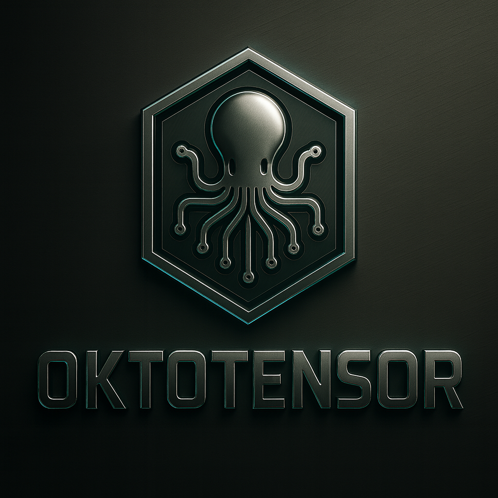

<p align="center">
  
</p>
<p align="center">
  
</p>
<h1 align="center">OktoTensor</h1>

<p align="center">
  <strong>GPU-Resident Tensor Engine • Native CUDA</strong>
</p>

<p align="center">
  Built by <strong>OktoSeek AI</strong> for the <strong>OktoSeek ecosystem</strong>
</p>

<p align="center">
  <a href="https://www.oktoseek.com/">OktoSeek Homepage</a> •
  <a href="https://github.com/oktoseek/oktoengine">OktoEngine</a> •
  <a href="https://x.com/oktoseek">Twitter</a> •
  <a href="https://www.youtube.com/@Oktoseek">YouTube</a>
</p>

---

## Table of Contents

1. [What is OktoTensor?](#-what-is-oktotensor)
2. [Why OktoTensor?](#-why-oktotensor)
3. [Design Philosophy](#-design-philosophy)
4. [Architecture Overview](#-architecture-overview)
5. [Key Features](#-key-features)
6. [OKM (OktoModel Format)](#-okm-oktomodel-format)
7. [Usage Examples](#-usage-examples)
8. [Performance](#-performance)
9. [Roadmap](#-roadmap)
10. [FAQ](#-frequently-asked-questions-faq)
11. [License](#-license)

---

## 🚀 What is OktoTensor?

**OktoTensor** is a **proprietary tensor engine** developed by **OktoSeek AI** to replace external dependencies and provide a **100% native stack** for AI training and inference.

Built **from scratch** with **zero dependency on Candle, PyTorch, or cuBLAS**.

### Key Highlights

| | |
|---|---|
| **100% Independent** | No external tensor library dependency |
| **GPU-Resident** | Tensors live on GPU, eliminating CPU round-trips |
| **Native CUDA** | Custom kernels for optimal performance |
| **Production Ready** | Powers OktoEngine training and inference |

---

## 🎯 Why OktoTensor?

### The Problem with Traditional Approaches

**Traditional Python/NumPy workflows:**
```
NumPy Array (CPU) 
  ↓ [Conversion overhead]
GPU Processing
  ↓ [Conversion overhead]
NumPy Array (CPU)
```

**Result**: Significant time spent on **conversions**, not computation!

### The Solution: GPU-Resident Computing

**OktoTensor approach:**
```
OktoTensor (GPU-resident)
  ↓
CUDA Kernel
  ↓
OktoTensor (GPU-resident)
```

**Result**: **Significant speedups** in Python workloads when using GPU-resident tensors!

---

## 💡 Design Philosophy

### 1. GPU-Resident by Default

Tensors are **designed to live on GPU**, not constantly transfer between CPU/GPU.

### 2. Efficient Memory Operations

Operations are optimized for **GPU memory**, minimizing unnecessary data movement.

### 3. Native CUDA Kernels

Custom **kernels** written specifically for our use cases, backed by high-performance CUDA kernels.

### 4. Execution-First

Optimized for **runtime performance**, not framework compatibility.

---

## 🏗️ Architecture Overview

OktoTensor provides a high-performance tensor runtime optimized for GPU execution. The architecture is designed for efficient memory management and fast computation, with seamless integration into the OktoEngine ecosystem.

### Execution Model

```python
# Traditional approach requires CPU-GPU transfers:
x_cpu = numpy.array([...])
# ... conversion overhead ...
result = compute_on_gpu(x_cpu)

# OktoTensor approach:
x = OktoTensor([...], device="cuda")  # GPU-resident
result = x.matmul(w)  # Efficient operation
# Result stays on GPU!
```

---

## ✨ Key Features

### 1. GPU-Resident Tensor Storage

Tensors **live on GPU** by default, eliminating CPU round-trips.

### 2. Persistent Weights

Weights remain **on GPU** throughout training, reducing transfer overhead dramatically.

### 3. Explicit Device Control

Full control over device placement (`cuda`, `cpu`) with seamless switching.

### 4. Pythonic API

Clean, intuitive API that feels natural to Python developers.

### 5. Integration with OktoBLAS

Built on top of OktoSeek's optimized compute backend for maximum performance.

### 6. Memory Pool

**Buffer reuse** to avoid frequent allocations/deallocations.

### 7. CPU Fallback

Automatic fallback to **CPU** when CUDA is unavailable.

---

## 📦 OKM (OktoModel Format)

**OKM (OktoModel Format)** is a proprietary binary format designed for extremely fast loading and direct GPU-resident execution inside OktoEngine.

OKM stores tensors in a deterministic memory-mapped layout, enabling efficient layer traversal and minimal overhead during model initialization.

Versioned, lightweight, and created specifically for high-performance AI runtimes.

### Key Characteristics

- **Proprietary binary format** optimized for native runtime performance
- **GPU-resident loading model** designed for extremely fast loading using memory-mapped layouts optimized for OktoEngine
- **The OKM format is runtime-oriented and tightly integrated with OktoEngine**
- **Supports versioning** for format evolution
- **Reduces overhead vs generic formats** by working directly with OktoEngine and OktoTensor
- **Future versions will support advanced loading modes** such as partial or on-demand tensor initialization
- **OKM stores tensors in a deterministic binary layout** enabling fast GPU uploads and sequential layer access

---

## 💻 Usage Examples

### Basic Operations

```python
from oktoengine import OktoTensor

# Create GPU-resident tensor
x = OktoTensor([[1, 2], [3, 4]], device="cuda")
w = OktoTensor([[5, 6], [7, 8]], device="cuda")

# Efficient operations
y = x.matmul(w)  # Stays on GPU
z = x.add(y)     # Stays on GPU
```

### Training Integration

```python
# Embedding layer
embedded = embedding.forward(input_ids)  # GPU-resident

# Linear layer
logits = linear.forward(embedded)  # GPU-resident

# Loss computation
loss = cross_entropy(logits, targets)  # GPU-resident

# All operations stay on GPU!
```

### Conversion to NumPy

```python
# Convert to NumPy when needed
result_numpy = result.cpu().numpy()
```

---

## 📊 Performance

### Key Benefits

- **Significant improvement** over NumPy-based flows
- **Designed for high throughput** training loops
- **Reduces data transfer overhead** dramatically
- **Delivers competitive performance** with established deep learning frameworks

### Memory Efficiency

OktoTensor is designed for GPU efficiency with controlled data movement, resulting in optimal memory usage and reduced overhead.

### Supports Various Configurations

Supports small and large vocabulary configurations efficiently, adapting to different workload requirements.

---

## 🗺️ Roadmap

### Current (v1.0)
- ✅ GPU-resident tensors
- ✅ Efficient memory operations
- ✅ Custom CUDA kernels
- ✅ Memory pool
- ✅ CPU fallback

### Planned (v1.1)
- ⏳ Tensor Cores optimization
- ⏳ Mixed precision (FP16/BF16)
- ⏳ Advanced operations

### Future (v2.0)
- ⏳ Multi-GPU support
- ⏳ Distributed training
- ⏳ Advanced memory management

---

## ❓ Frequently Asked Questions (FAQ)

### Q: Is OktoTensor open source?

**A:** OktoTensor is **proprietary** to OktoSeek AI. The **concepts** and **architecture** are documented, but the **implementation** is closed-source.

### Q: Can I use OktoTensor with PyTorch?

**A:** OktoTensor is designed for **OktoEngine native execution**. For PyTorch, use PyTorch's native tensors.

### Q: How does OktoTensor compare to other frameworks?

**A:** OktoTensor is **GPU-resident by default** and optimized for efficient memory operations, resulting in **significant speedups** in many workloads. It's designed specifically for the OktoSeek ecosystem.

### Q: Does OktoTensor work on CPU?

**A:** Yes! OktoTensor has a **CPU fallback** with parallel processing and SIMD optimizations.

### Q: What's the difference between OktoTensor and Candle?

**A:** OktoTensor is **100% proprietary** and **GPU-resident by default**, while Candle is a Rust tensor library with different design goals.

### Q: How do I get started?

**A:** OktoTensor is part of the OktoEngine ecosystem. Check out [OktoEngine](https://github.com/oktoseek/oktoengine) for getting started.

---

## 📄 License

**OktoTensor** is **proprietary** to **OktoSeek AI** and part of the **OktoEngine** ecosystem.

---

## 📞 Contact

- **Website**: [oktoseek.com](https://www.oktoseek.com)
- **GitHub**: [github.com/oktoseek](https://github.com/oktoseek)
- **Twitter**: [@oktoseek](https://x.com/oktoseek)
- **YouTube**: [@Oktoseek](https://www.youtube.com/@Oktoseek)

---

<p align="center">
  <strong>Built with ❤️ by OktoSeek AI</strong>
</p>
